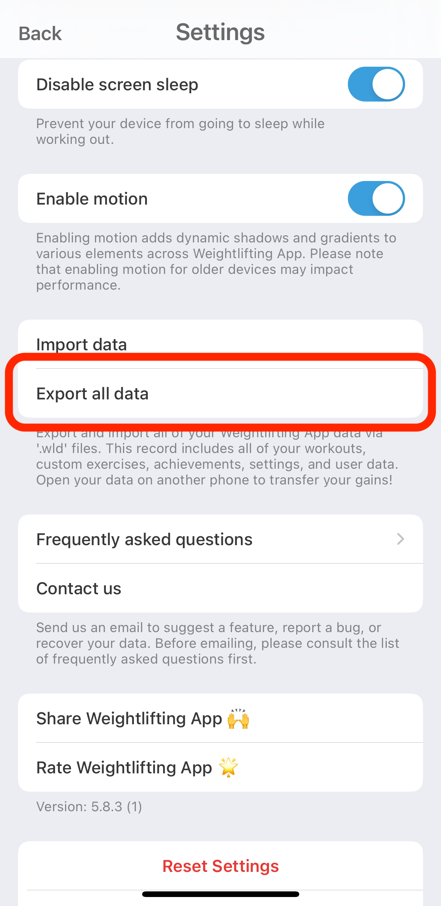

# Weightlifting App Analyze Data

This repo provides a variety of scripts to analyze the data from [Weightlifting App](https://apps.apple.com/us/app/weightlifting-app/id1266077653) 💪

## Setup

1. Open [Weightliting App](https://apps.apple.com/us/app/weightlifting-app/id1266077653) on your iPhone and navigate to User -> Settings -> Export All Data.

2. Send the data to yourself (eg. via email)

3. Place the `.wld` file in the `data` folder as `data.wld`

4. Run `pip install -r requirements.txt` to install the dependencies

5. Run any of the scripts in the `src/notebooks/` folder or create your own!

## Contributing

Feel free to contribute to this repo by adding your own scripts or improving existing ones.

## License

This project is open-sourced under the MIT License - see the [LICENSE](LICENSE) file for details.
