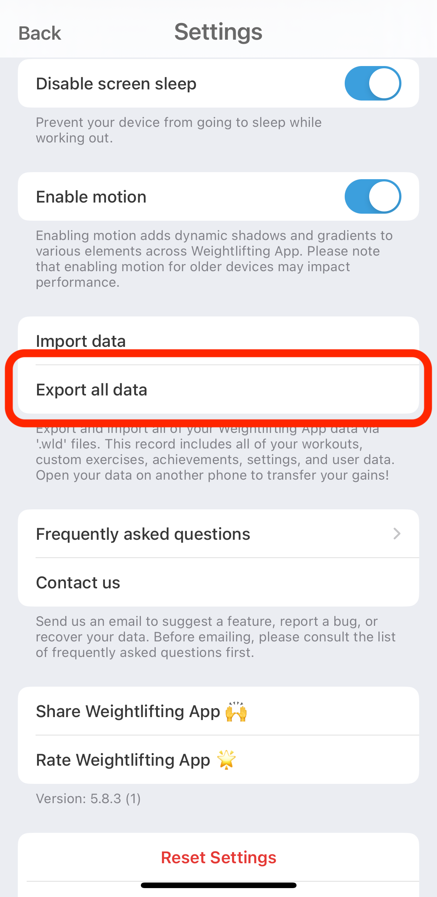

# Weightlifting App Analyze Data

This repo provides a variety of scripts to analyze the data from [Weightlifting App](https://apps.apple.com/us/app/weightlifting-app/id1266077653) 💪

## Data setup

You can either use your own data or use the example data provided in the `data/example-*.wld` files.

### Using your own data

1. Open [Weightliting App](https://apps.apple.com/us/app/weightlifting-app/id1266077653) on your iPhone and navigate to User -> Settings -> Export All Data.



2. Send the data to yourself (eg. via email)

3. Place your `.wld` file in the `data` folder and update the `file_path` in the `WLD` class in the notebook to the name of the file(s) you want to use.

## Setup

Python 3.10 or newer is required.

```bash
python3 -m venv .venv
source .venv/bin/activate
python -m pip install -e ".[notebooks]"
```

## Usage

Run any of the `.ipynb` Jupyter notebooks in the `src/` folder or create your own.

For analyses that would otherwise walk the nested export structure, load the
canonical dataset instead. It returns flat workout, exercise, and set
DataFrames with documented columns (see [docs/training-dataset.md](docs/training-dataset.md)):

```python
from training_dataset import load_training_dataset

data = load_training_dataset("../data/example-chappy.wld")
data.sets[data.sets["display_name"] == "Flat Barbell Bench Press"]
```

Key analyses:

- Use `src/analyze_big_three.ipynb` for lifetime Big Three progression, annual snapshots, historical trends, and one-year projections.
- Use `src/analyze_bodyweight_strength_evals.ipynb` for bodyweight-aligned strength history, all-attempt Pareto frontiers, and social-card exports for bench, squat, deadlift, and overhead press.

To refresh the bodyweight and DEXA CSV exports from `Weight Log.xlsx`:

```bash
python scripts/convert_weight_xlsx.py
python scripts/convert_dexa_xlsx.py
```

## Development

Install the test dependencies and run the complete suite from the repository root:

```bash
python -m pip install -e ".[dev]"
python -m pytest
```

## Contributing

Feel free to contribute to this repo by adding your own scripts or improving existing ones.

## License

This project is open-sourced under the MIT License - see the [LICENSE](LICENSE) file for details.
